# Brain Tumor Segmentation with UNet-VGG16

This repository contains the implementation of a UNet-based neural network for brain tumor segmentation in MRI images.

## Overview

The UNet architecture has been widely adopted in medical image segmentation tasks due to its effectiveness in capturing detailed features and spatial information. This implementation leverages UNet to accurately segment brain tumors from MRI scans
by Flair type and Axial Position.

## Demo
[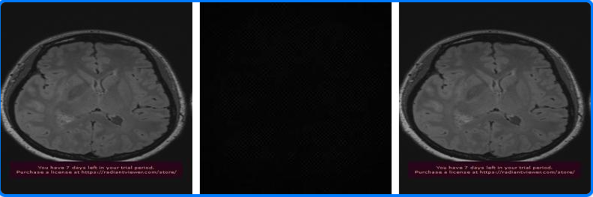](imgs/Demo.mp4)


### UNET Model Architecture

- **Encoder**: The encoder part of the UNET uses a pre-trained **VGG16** model for better feature extraction.
- **Decoder**: The decoder reconstructs the image by upsampling, using skip connections to recover spatial information lost during downsampling.
- **Output Layer**: The final layer uses a sigmoid activation function to output the segmented tumor mask.
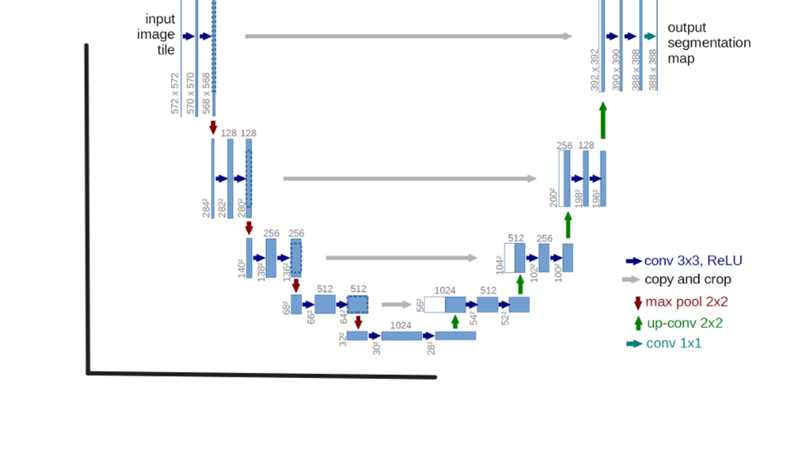

### MRI Types
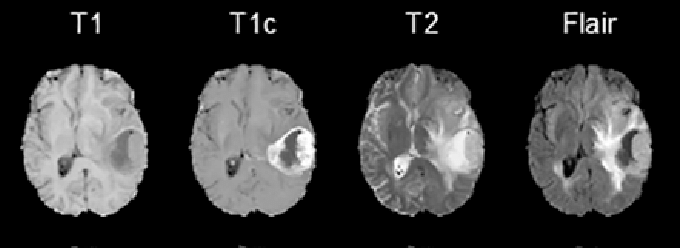

### MRI Planes
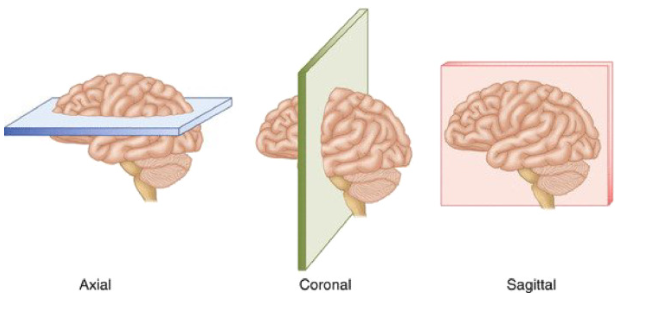

## Requirements

- Python 3.11
- NumPy
- glob
- opencv
- tqdm
- TensorFlow
- Keras
- albumentations 

### Install dependencies:

```python
pip install -r requirements.txt
```

## Model Training

- **Dataset**: MRI images were collected in collaboration with Assiut University Hospital. Ground truth masks were created using **ImageJ**, supervised by expert radiologists.
- **Training**: The UNET model was trained on MRI images, with tumor regions manually labeled.
- **Validation**: Early stopping and model checkpointing were used to save the best-performing model during training.
- **Loss Function**: The **Dice coefficient** was used as the primary loss function to evaluate the overlap between predicted masks and ground truth and you can look at `log-vgg16.csv` file to show the result of each epoch.

### Training and Validation Results
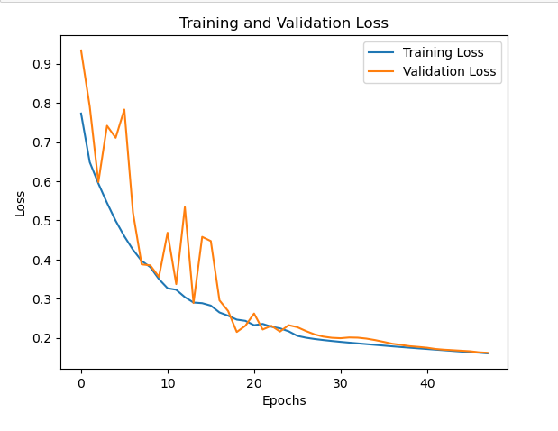

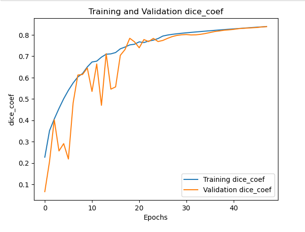

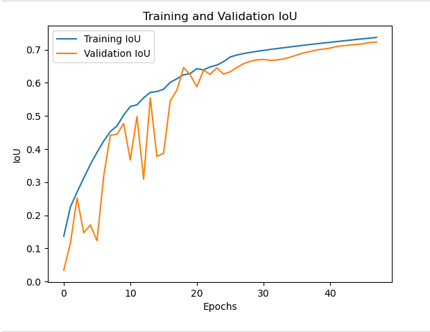


## Results
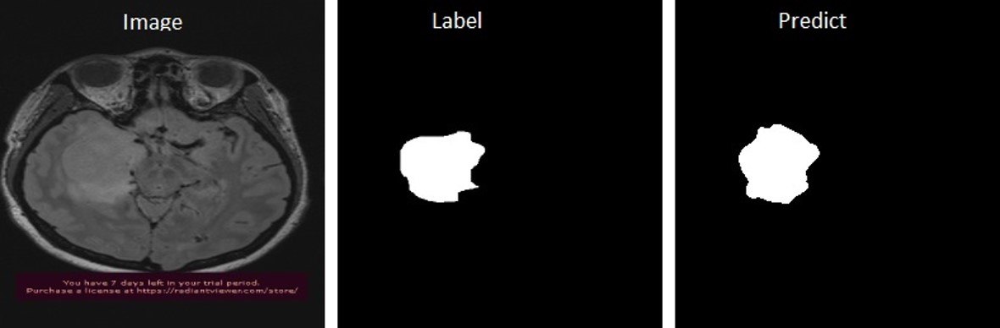

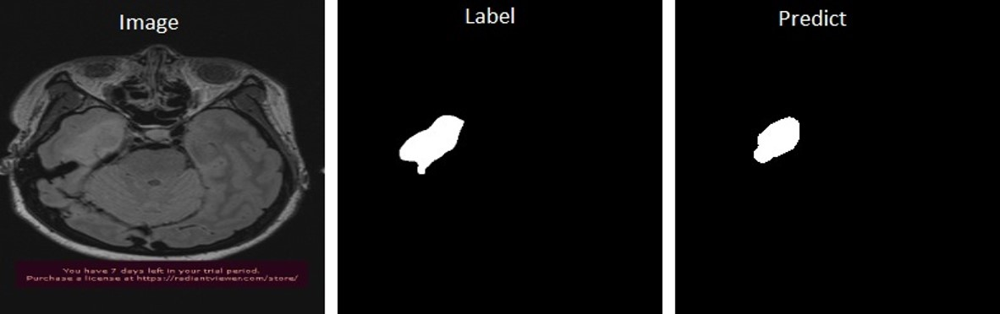

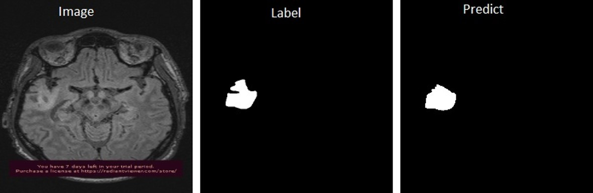

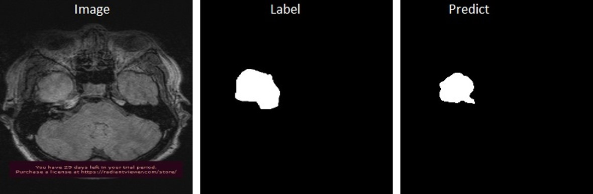

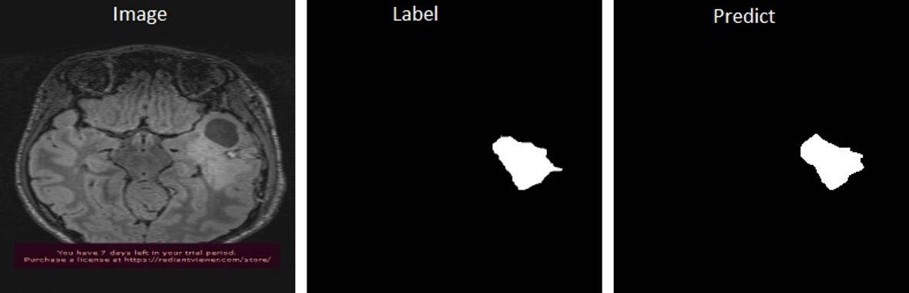

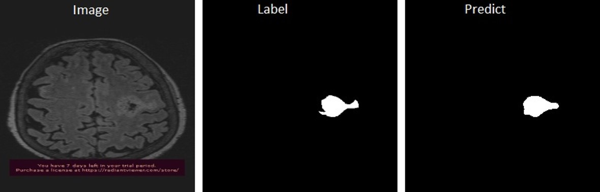

### if the image isn't a brain the result:
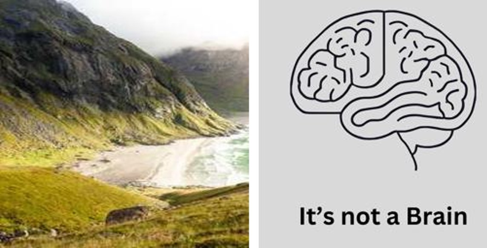

### if the image is Brain and the tumor isn't found

